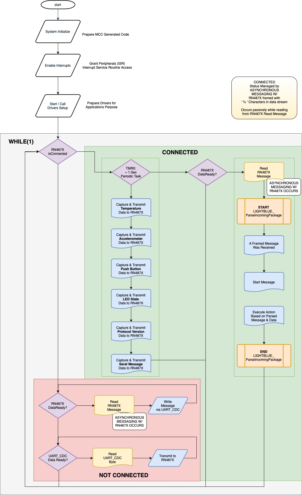
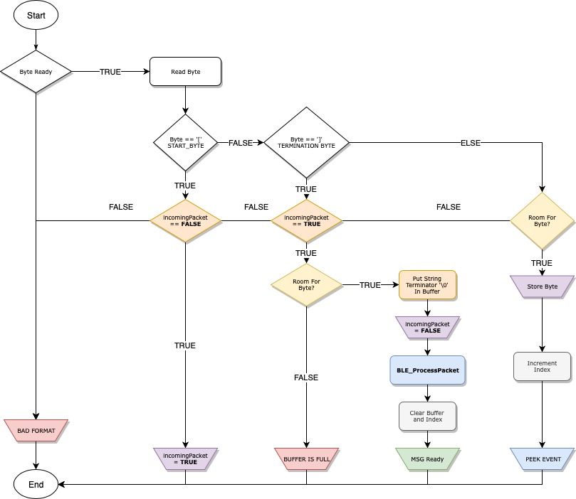
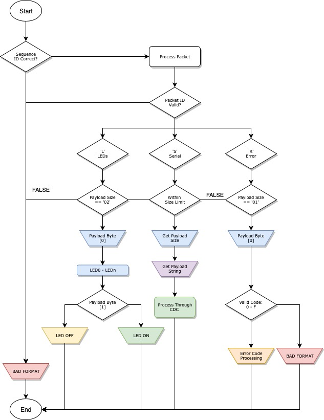
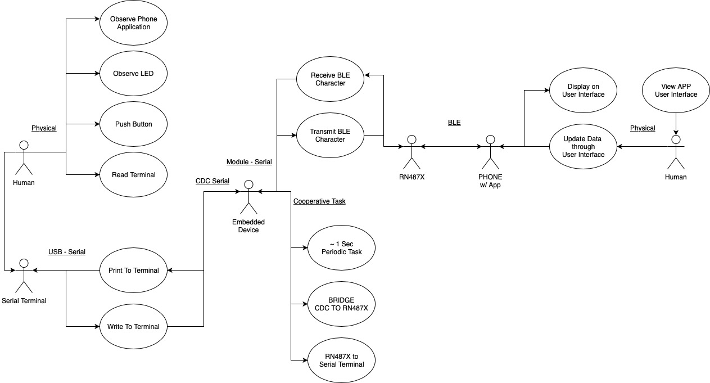
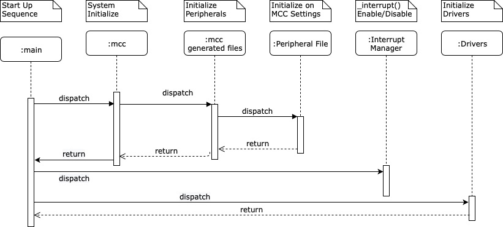
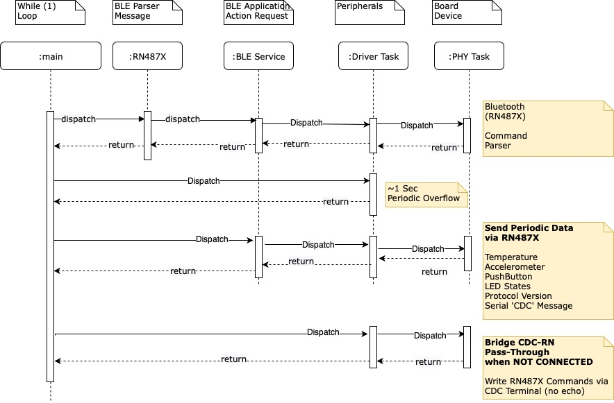

# AVR IoT BLE
---
Devices (Device): \| **ATmega3208(MCU)** \| **RN4870(BLE)** \| **MCP9844** \| **BMA253** \|
Devices (Unused, On-Board): \| **ECC608(Crypto)** \| **SST25PF040CT** \| **CLICK Header** \|

## Demonstration Features
1. Bridged Communication between CDC <--> RN Module when in DISCONNECTED state
    - Allow for direct execution of commands of RN487X Module
    - Refer to [User Guide | http://ww1.microchip.com/downloads/en/DeviceDoc/50002466B.pdf] for details of use. 
2. There are No Application behaviors when NOT CONNECTED outside the Bridge communication feature.
3. Use the LightBlue(tm) by Punch Through for BLE demonstration. 
    - Application is supported by iOS & Android Cell Phone devices.
    - Available in the Application Store
4.  Demonstration uses character profile configured to allow for format specification with the phone application
    - Microchip Logo & Name will appear for BLE devices containing the names:
        * PIC-BLE
        * AVR-BLE
        * RN487X
5. When CONNECTED(ING) to the application the BLUE LED (BLE) will turn on.
    - The LED will BLINK during the interrogation process.
    - Interrogation process is very fast, BLINKING may not be observable
6. From the Phone Application the following actions can be performed.
    - LEDs State toggled based upon toggle switches. (Top Left)
    - Push Button status is shown. (Top Right)
    - Accelerometer X, Y, Z data is visible via horizonal scroll bars. (Middle)
    - Strings Typed into the CDC Terminal while CONNECT are displayed on the screen. (Middle Bottom
        * Shown in ASCII
        * Shown in Hex
    - Data can be written into the Terminal and sent to the End-Device.
        * Sent in ASCII (String) form
        * Sent in Hex (base 16) form
6. The application will display Data sent from the LightBlue Explorer Demo every ~1 Second.
    - Data is sent as 'Characters', & displayed in varied form.
        * Temperature value: Sent as (int16_t) hex Celsius value - Displayed Celsius or Fahrenheit
        * Accelerometer value: Sent as (int16_t) hex 12-bit values - Displayed + / - (X, Y, Z)
        * Push Button State: Sent as (uint8_t) hex boolean value represented per button - 0 / 1 (NOT PUSHED / PUSHED)
        * LEDs Status: Sent as (uint8_t) hex boolean value  represented per button - 0 / 1 (OFF / ON)
        * Protocol Version: Sent as (uint8) hex value representing demo firmware version - 01 (Version 1)

## Application Design
1. Peripheral and System Requirements configured via MCC.
2. Feature Library: RN2487X Driver Code
3. Library Usage: Foundation Services (I2C, SPI, EUSART, DELAY), Timer0
4. GPIO(s): (1) Push Button - SW0, (3) LEDs - DATA (Green, MCU controlled), ERR(Red, RN487X p2_2 controlled), BLE (Blue, RN487X)

## Application Architecture

![Detailed Design: Parsing](images/BLE-IoT-Detailed_Parser.jpg





```